# 🚀 NotePilot AI

> **An AI-powered study companion that transforms your PDF notes into interactive learning experiences using Retrieval-Augmented Generation (RAG) and Large Language Models (LLMs).**

---

# 📖 About

**NotePilot AI** is a smart learning assistant designed to make studying faster and more effective.

Instead of reading hundreds of pages repeatedly, users simply upload their study notes, and NotePilot AI converts them into interactive learning tools such as:

- 💬 AI Chat
- 📝 Study Notes
- 🧠 Flashcards
- ❓ AI Quiz
- 📚 Revision Questions
- 🎤 Mock Viva
- 🎯 Exam Predictor

The application uses **Retrieval-Augmented Generation (RAG)** so every answer is grounded in the uploaded study material rather than relying solely on a language model.

---

# ✨ Features

## 📄 PDF Upload

- Upload study notes in PDF format
- Automatic text extraction
- Semantic chunking
- Vector embedding generation
- FAISS indexing

---

## 💬 AI Chat

Chat directly with your uploaded notes.

### Features

- Context-aware conversations
- Conversation memory
- Retrieval-Augmented Generation (RAG)
- General knowledge fallback
- Markdown formatted responses
- Copy responses instantly

---

## 📝 AI Study Notes

Generate well-structured study notes automatically.

Perfect for:

- Quick revision
- Last-minute preparation
- Understanding lengthy topics

---

## 🧠 Flashcards

Generate interactive flashcards from uploaded notes.

Features include:

- Previous / Next navigation
- Flip animation
- Persistent storage
- AI-generated definitions

---

## ❓ AI Quiz Generator

Generate multiple-choice quizzes automatically.

Includes:

- Randomized options
- Instant evaluation
- Score calculation
- AI-generated questions

---

## 📚 Revision Mode

Generate rapid revision questions.

Useful for:

- Self-testing
- Concept recall
- Quick practice

---

## 🎤 Mock Viva

Practice oral examinations using AI.

Features:

- AI-generated viva questions
- Written responses
- AI evaluation
- Personalized feedback

---

## 🎯 Exam Predictor

Predicts the most probable exam questions from uploaded notes.

Great for:

- Exam preparation
- Identifying important topics
- Smart revision

---

## 📊 Dashboard

Track your learning activity.

Displays:

- Uploaded document
- Total uploads
- Questions asked
- Learning statistics

---

# 🛠 Tech Stack

## Frontend

- React
- Vite
- Tailwind CSS
- Axios
- React Markdown
- React Hot Toast
- Lucide Icons

---

## Backend

- FastAPI
- Python

---

## AI & NLP

- Groq LLM API
- Sentence Transformers
- FAISS
- Retrieval-Augmented Generation (RAG)

---

## PDF Processing

- PyPDF

---

# 🧠 RAG Pipeline

               PDF Upload
                    │
                    ▼
          Text Extraction (PyPDF)
                    │
                    ▼
          Semantic Text Chunking
                    │
                    ▼
     SentenceTransformer Embeddings
                    │
                    ▼
            FAISS Vector Index
                    │
                    ▼
          Similarity Search (Top-K)
                    │
                    ▼
             Groq LLM Context
                    │
                    ▼
           AI Generated Response

---

# 📸 Application Screenshots

## 🏠 Home Dashboard

The landing page provides quick access to all AI-powered study tools.

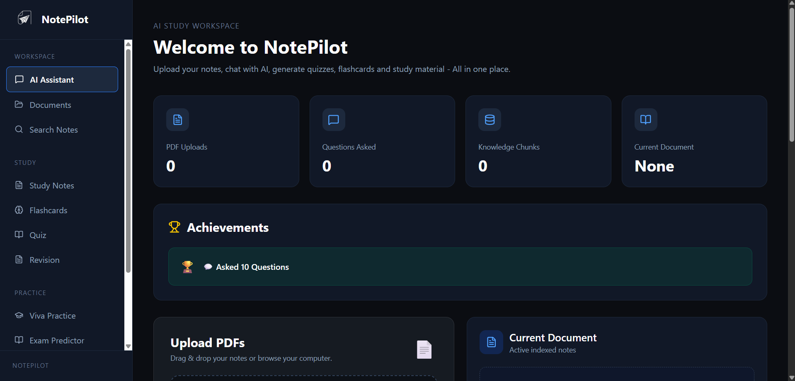

---

## 📄 PDF Upload

Upload your study notes and automatically build the RAG knowledge base.

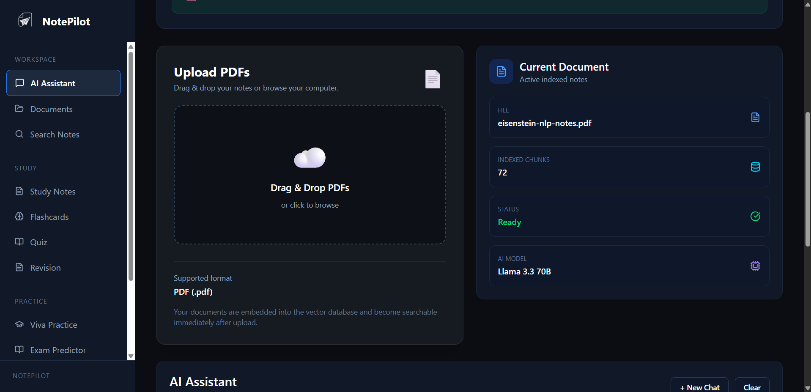

---

## 💬 AI Chat

Chat intelligently with your uploaded notes using Retrieval-Augmented Generation (RAG).

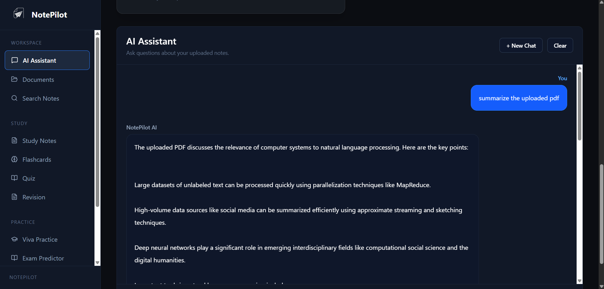

---

## 📝 AI Study Notes

Generate concise, well-structured study notes from lengthy PDFs.

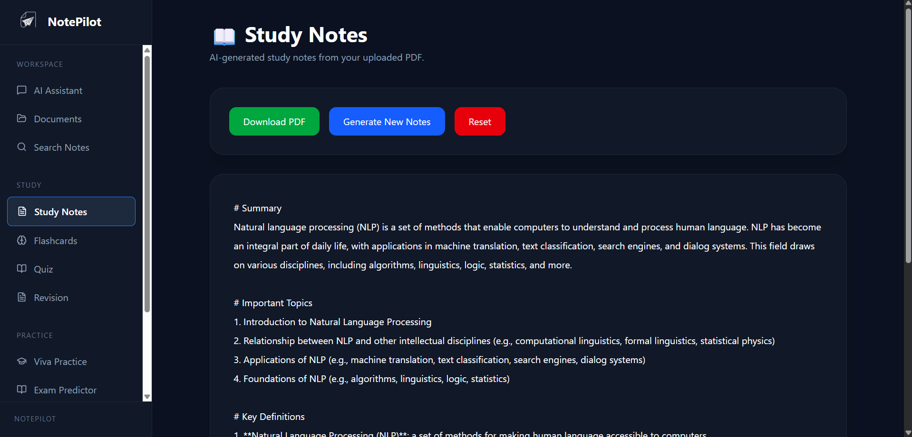

---

## 🧠 Flashcards

Interactive flashcards for quick revision and concept recall.

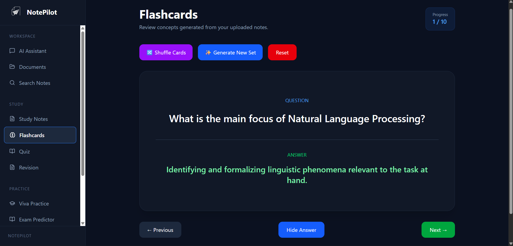

---

## ❓ AI Quiz

Automatically generated multiple-choice quiz from uploaded notes.

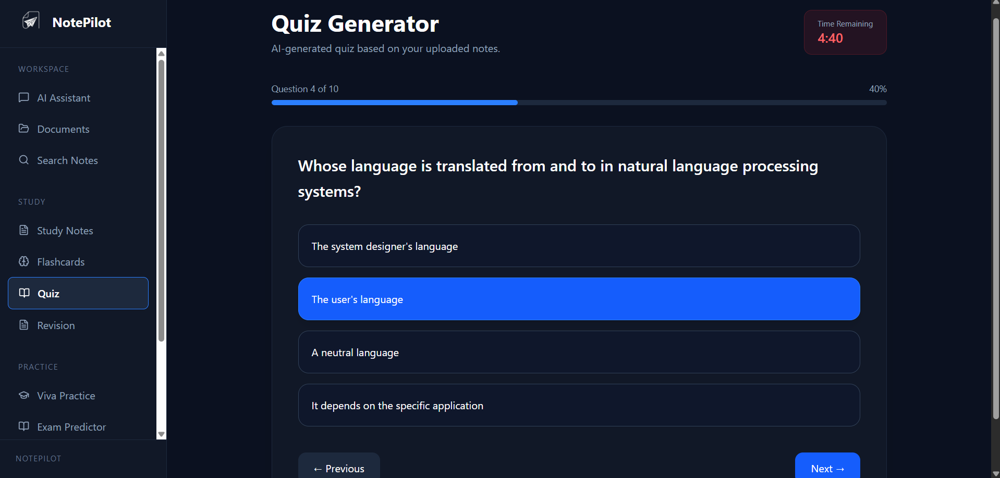

---

## 📊 Quiz Evaluation

Instant quiz scoring with answer validation.

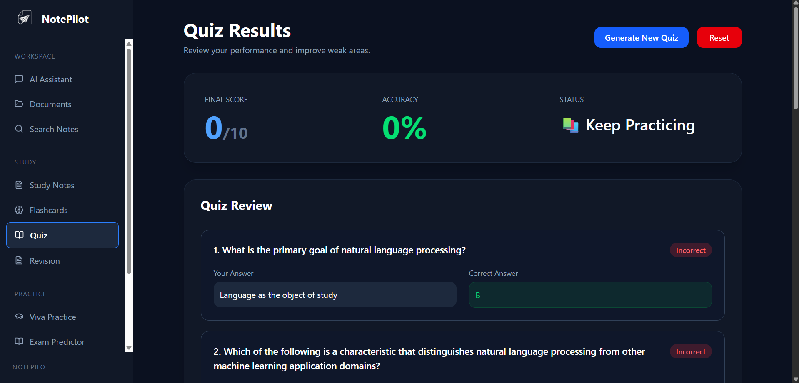

---

## 📚 Revision Mode

Rapid-fire revision questions for exam preparation.

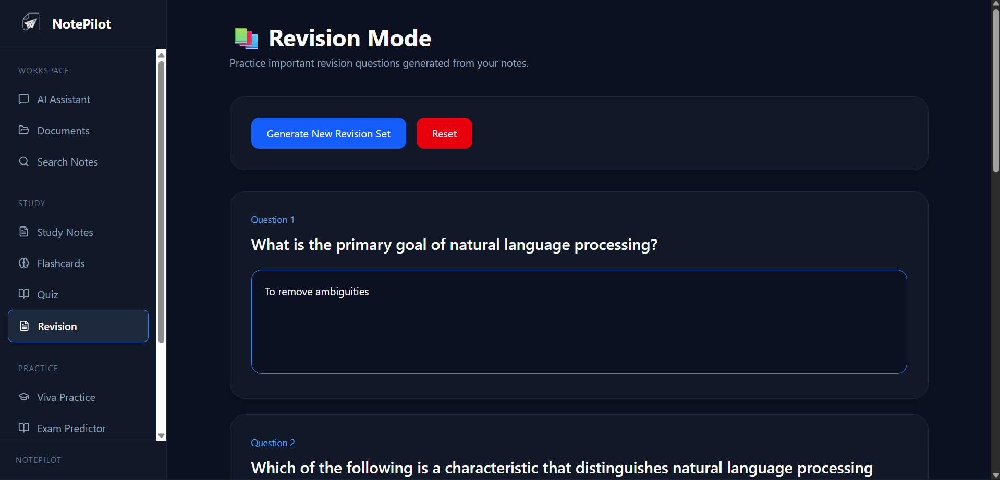

---

## 🎤 Mock Viva

Practice oral examinations with AI-generated viva questions and instant feedback.

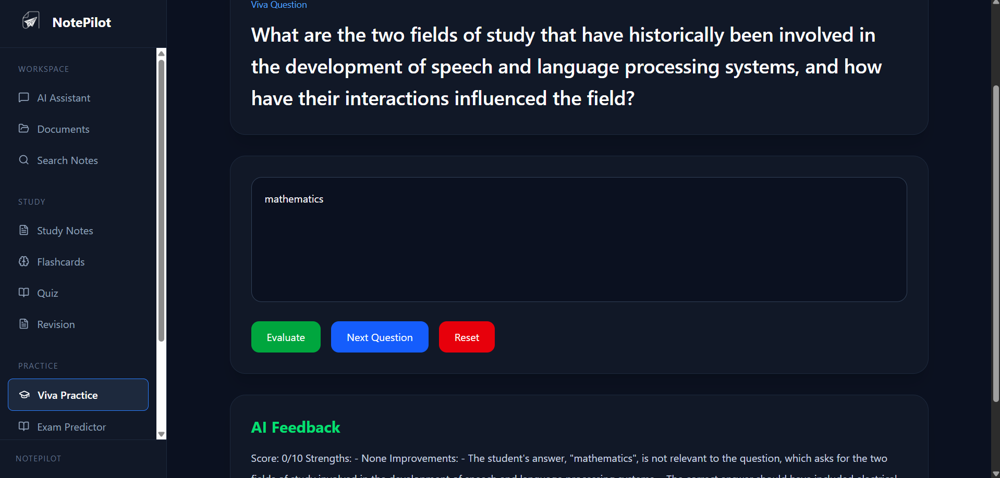

---

## 🎯 Exam Predictor

Predict the most likely exam questions based on uploaded study material.

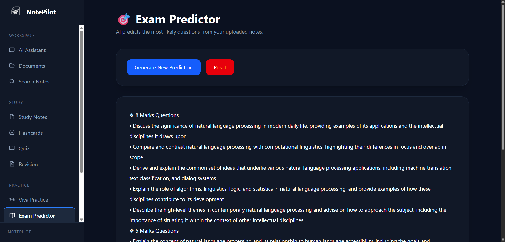

---

## 📁 Document Manager

Manage uploaded PDFs including upload history and deletion.

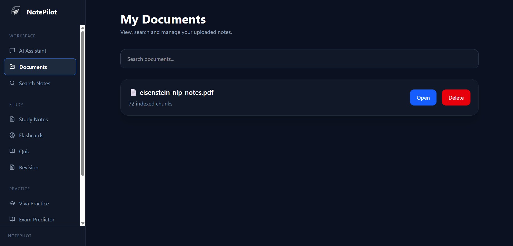

---

## 📈 Learning Analytics

Track usage statistics including uploads, questions asked, and learning progress.

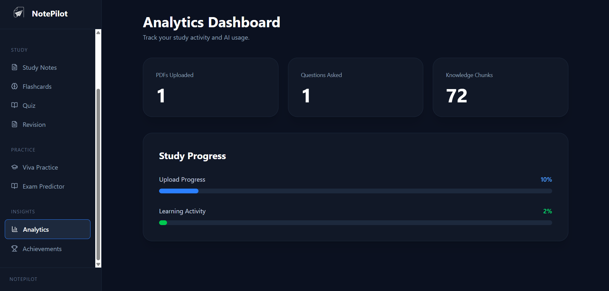

---

## 🎙 Voice Support

Ask questions hands-free using speech recognition.

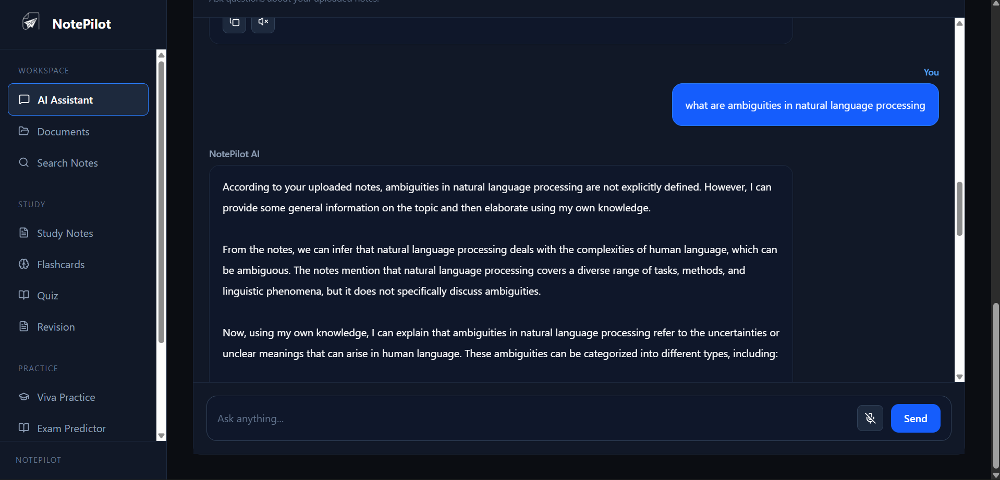

# 🚀 Installation

## Clone Repository

git clone https://github.com/YOUR_USERNAME/NotePilot-AI.git

---

# Backend

cd backend

pip install -r requirements.txt

uvicorn main:app --reload

---

# Frontend

cd frontend

npm install

npm run dev

---

# Environment Variables

## Backend (.env)

GROQ_API_KEY=YOUR_GROQ_API_KEY

---

## Frontend (.env)

VITE_BACKEND_URL=http://127.0.0.1:8000

---

# 📂 Folder Structure

NotePilot-AI/

│
├── backend/
│   ├── main.py
│   ├── rag-service/
│   ├── uploads/
│   └── requirements.txt
│
├── frontend/
│   ├── src/
│   ├── public/
│   └── package.json
│
├── screenshots/
│
└── README.md

---

# 🎯 Future Enhancements

- User Authentication
- Cloud PDF Storage
- Multi-document Chat
- OCR Support
- Voice Chat
- AI Mind Maps
- Spaced Repetition
- Export Flashcards
- Dark/Light Theme

---

# 👨‍💻 Author

## Yug Panchal

AI/ML Enthusiast | Full Stack Developer

- GitHub: https://github.com/yugsgithub
- Email: panchalyug82@gmail.com

---

# ⭐ Support

If you found this project helpful, please consider giving it a ⭐ on GitHub.

It motivates further development and helps others discover the project.

---

## 💡 Recruiter Note

This project demonstrates practical experience with:

- Retrieval-Augmented Generation (RAG)
- Large Language Models (Groq)
- Semantic Search using FAISS
- React + FastAPI Full Stack Development
- Prompt Engineering
- Vector Databases
- AI-powered Educational Applications
- REST API Development
- Modern Responsive UI Design